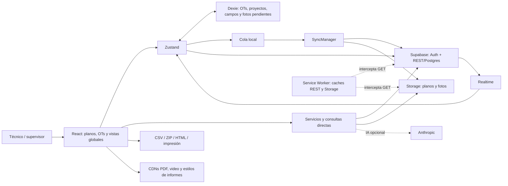
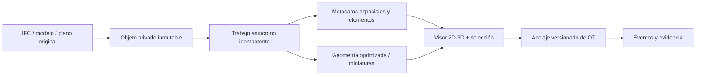

# Plan-OTs — diagnóstico técnico, comercial y de plataforma

**20 de septiembre de 2026 · HEAD `4d1851e` · Diagnóstico sin modificar la aplicación**

**Actualización posterior:** ya se verificó el servidor desde Supabase. Consultar [control actual y preparación de correcciones](../estabilizacion-2026-09-20/CONTROL-SUPABASE.md): las políticas indiscriminadas de la tabla fotos y las dos vistas fueron corregidas previamente; Storage sigue expuesto, existe índice único de OT y el plan actual no incluye backups. El cuerpo de este informe conserva el corte inicial de evidencia.

Lectura recomendada: este informe, [backlog ejecutable](BACKLOG.md), [evidencia y alcance](VERIFICACION.md). Rutas de código relativas a `C:\Users\Usuario\Desktop\plan-ots`; números de línea correspondientes al HEAD auditado. Los identificadores Bxxx remiten al backlog.

**Convenciones de evidencia:** **C** = comprobado mediante ejecución local/inspección directa; **I** = implementación conectada identificada, sin validación E2E remota; **H** = antecedente documental de julio de 2026, sin revalidación actual; **P** = propuesta; **?** = requiere evidencia externa. No se equipara compilación exitosa con producto terminado.

## 1. Resumen ejecutivo

Plan-OTs tiene una base valiosa para gestionar intervenciones de mantenimiento, posventa y obra sobre planos 2D. El producto conecta órdenes, ubicación visual, responsables, fechas, costos, fotos antes/durante/después e informes. Su mayor valor está en facilitar el trabajo de campo y organizar evidencias de lo ejecutado.

**No recomiendo todavía ofrecerlo como servicio comercial confiable ni como sistema multicliente con garantías de aislamiento.** Compila y arranca, pero existen defectos reproducidos que pueden perder cambios offline, borrar operaciones pendientes, mostrar información local de otra cuenta y emitir informes incompletos. Hay además superficies de XSS activas y PDF.js vulnerable. La seguridad actual de Supabase no pudo certificarse con los archivos locales; una auditoría histórica documenta permisos excesivos que deben comprobarse antes de cualquier piloto.

No hace falta reescribir todo ni adoptar microservicios. El camino más corto es estabilizar los contratos de datos, la sincronización, los límites de autorización y la operación. Después, convertir la ubicación y los archivos en entidades independientes del proyecto y preparar contratos reutilizables con Fio Pro.

Resultados verificables:

- **TypeScript y build/PWA pasan.** Bundle principal de 2,19 MB sin comprimir y 578 kB gzip; el límite de precache ya fue ajustado.
- **ESLint falla:** 57 errores y 16 advertencias. No todos son defectos funcionales; hay reglas de hooks, tipos y código residual.
- **16 reproducciones locales**: 15 documentan fallos/limitaciones; una confirma que el escape del informe de cierre fue corregido. Son pruebas con adaptadores, no pruebas de producción.
- **npm audit actual:** 11 paquetes afectados, incluido PDF.js utilizado en el cliente. La alerta crítica de `tar` corresponde al árbol de dependencias, no a una ejecución remota demostrada en la aplicación.
- No se halló una clave privada real en los patrones examinados. La clave Supabase local es `anon` y la de IA es un placeholder. No se publican valores.

## 2. Qué es realmente el producto

El usuario crea un proyecto con un plano PDF o imagen, coloca órdenes sobre él o importa una lista CSV, registra datos y evidencias, sigue avances y produce documentación. Las vistas de grilla, dashboard, responsables, contratistas, Gantt y calendario reutilizan esas órdenes.

Usuarios plausibles, inferidos del flujo: empresas de facility management, constructoras que atienden posventa/garantías, supervisores y técnicos de mantenimiento. El problema resuelto es pasar de listas, mensajes y fotos dispersas a intervenciones localizables y documentadas.

**Hoy:** aplicación centrada en proyecto + un plano + OTs; localización mediante fracciones `pos_x/pos_y`; responsable y contratistas mayormente como texto; evidencia fotográfica; formularios flexibles; documentos imprimibles. Gantt y calendario muestran fechas guardadas; no hay un motor de programación de recursos ni navegación física indoor.

**Futuro posible, aún no implementado:** varios edificios/pisos/ambientes, varios documentos versionados, OTs ligadas a elementos BIM y ubicaciones 3D, identidad organizacional, integraciones empresariales y componentes compartidos con Fio Pro.

Ventajas que podrían diferenciarlo: rapidez de captura en obra, localización sobre el activo, continuidad sin conexión y dossier de evidencia. Hoy la promesa offline supera la confiabilidad de la implementación; debe resolverse antes de usarla como argumento comercial.

## 3. Arquitectura actual

### Inventario y stack

206 archivos locales propios/históricos/configuración inventariados, incluidos 83 TS/TSX de fuente (~22.826 líneas). Un único `package.json`; aplicación SPA, sin servidor de negocio, monorepo ni API propia desplegable en el repositorio.

| Capa | Implementación real |
|---|---|
| Entrada | `index.html` → `src/main.tsx` → `src/App.tsx` |
| UI | React 19.2.6 instalado; TypeScript 6.0.3; CSS Modules, CSS global, estilos inline y modo tablet |
| Navegación | Estado local `vista` y switch en App; sin router ni deep links por OT/proyecto |
| Estado | Zustand 5.0.13: auth, proyectos, órdenes; otro store interno para roles de costos |
| Persistencia remota | Supabase JS 2.105.4 → Auth, PostgREST/Postgres, Storage, Realtime |
| Persistencia local | Dexie 4.4.2 / IndexedDB `PlanOTsDB`, esquema v4→v5→v6; localStorage adicional |
| Offline | `SyncManager.ts`; cola para CREATE/UPDATE/DELETE de OT y UPLOAD_FOTO |
| Archivos y visualización | PDF.js 3.11.174, canvas, imágenes; Three.js 0.184.0 para un prototipo |
| Import/export | PapaParse 5.5.3, JSZip 3.10.1, HTML imprimible, firma dibujada con signature_pad |
| Video | FFmpeg WASM cargado bajo demanda desde CDN; upload directo desde navegador |
| IA | Llamada directa a Anthropic desde navegador; actualmente modo manual por placeholder |
| Build | Vite 8.0.11, vite-plugin-pwa 1.3.0 / Workbox; scripts dev/build/lint/preview |
| Operación | Script de preflight y documentación histórica; sin CI, Docker, migraciones SQL ni runbook completo versionados |

### Modelo de datos inferido de llamadas actuales

| Entidad | Relaciones/datos observados | Brecha |
|---|---|---|
| `proyectos` | nombre, cliente textual, descripción, `plano_url`, creador, rubros/técnicos, timestamps y soft delete | No organización ni entidad independiente de plano |
| `ordenes` | UUID, proyecto, código visible, estado, prioridad, responsable textual, coordenadas, campos JSON, fechas, costo y estados/URLs de documentos | Contratos online/offline/realtime divergentes; sin ubicación versionada |
| `fotos` | OT + proyecto, categoría, URL/path/tipo; descripciones y anotaciones | No manifiesto de versiones/originales/ciclo de vida coherente |
| `campos_definicion` | proyecto, tipo, opciones, obligatorio, orden | Validación incompleta y escrituras offline sin sincronizador |
| `versiones` | proyecto, autor, nombre, snapshot JSON de parte de las OTs | No versiones del archivo plano ni historial completo |
| `proyecto_miembros` | proyecto, usuario, rol | Se consulta; no gestión real de miembros desde la UI |
| `ot_comentarios` | transiciones, texto, actor/email y fecha | Escritura separada del cambio de estado |
| `comentarios_ot` | conversación libre, actor/nombre y fecha | Segundo sistema paralelo, sin cola offline |
| `dashboard_configs` | usuario, configuración de widgets | Fallback local con clave global |
| `eventos_uso` | usuario, proyecto, heartbeat | Telemetría, no auditoría de negocio |

Son **10 tablas referenciadas por el código actual**, sin confirmar su definición remota hoy. La auditoría H menciona además `sync_log`, `ordenes_eliminadas`, dos vistas, funciones/triggers y bucket `exports`; no deben confundirse con funcionalidad activa de UI. No se verificaron FK, índices, constraints o cascadas actuales.

### Flujos y separación de responsabilidades

Lectura remota → mapeo → reemplazo Dexie → Zustand → UI. Una OT se modifica de forma optimista antes de confirmar el servidor; en fallo se encola. La sincronización posterior usa otros mapeos y no reconcilia correctamente el acuse. Fotos combinan upload y registro SQL; algunas fallas se recuperan conservando path y binario.

Hay una separación inicial útil por servicios, pero los componentes también acceden directamente a Supabase y contienen reglas de negocio y generación de HTML. `PanelOT` tiene 1.300 líneas, `Gantt` 1.107, `VistaGrilla` 925 y `reportService` 1.382. La deuda principal es la divergencia de comportamiento, no el tamaño por sí solo.

## 4. Funcionalidades actuales

| Capacidad | Estado real | Evidencia / límite |
|---|---|---|
| Arranque y formulario de acceso | **C** | Build abierto en navegador; validación de formulario vacío observada |
| Login/registro email | **I**, parcial en UX | Supabase Auth conectado; registro anuncia éxito aunque el store guarde error; falta recuperación real |
| Google | **Placeholder** | `AuthForm.tsx:53`, solo console.log |
| Proyectos | **I** | Crear/subir plano, listar, soft delete y duplicar; duplicar comparte plano y no copia las OTs |
| Planos 2D | **I** | PDF/imagen, zoom/pan, marcadores, creación y drag/drop; PDF solo página 1 |
| Órdenes | **I**, fallos **C** | CRUD con muchos campos; persistencia online conectada, paridad offline rota |
| Grilla y detalle | **I** | Filtros, columnas, tarjetas, paginación de presentación y export; no paginación remota |
| Evidencias | **I**, offline parcial | Fotos y cola de binarios con reintento manual; videos y editor no comparten todas esas garantías |
| Anotaciones | **I** | Editor canvas con texto/flechas/etc.; divergencia URL/path y conservación de original incompleta |
| Formularios/firma | **I**, parcial | Campos de varios tipos; obligatoriedad no garantizada servidor; firma es imagen, no proceso de validación documental |
| CSV | **I** | Wizard con mapeo, normalización y renombrado de duplicados; import secuencial y no transaccional |
| `.otproj` | **Parcial C** | Export metadatos/URLs incompleto; no importador conectado aunque README interno lo indica |
| Versiones | **Parcial C** | Comparación de snapshots de OTs; restauración parcial puede informar éxito falso |
| Informes de OT | **I** | Cinco familias activas, HTML/impresión; no archivo PDF persistido, enviado o firmado automáticamente |
| Informe general/dashboard/calendario | **I**, riesgo **C** | HTML generado con interpolaciones sin escape |
| Notificaciones | **Parcial I/H** | Realtime en memoria, máximo 30, depende de old-record completo; no buzón persistente/push |
| Responsables | **I** | Agrupación de texto de OTs; no directorio de usuarios asignables con identidad estable |
| Contratistas | **Parcial I** | Datos de OTs más catálogo localStorage; no gestión empresarial sincronizada |
| Miembros/invitaciones | **Simulado** | `Configuracion.tsx:64–99`, usuario sintético y setTimeout |
| Calendario semanal/diario | **Pendiente** | `Calendario.tsx:483` |
| Cobros/suscripciones, borrar cuenta, avatar | **Placeholder** | Tarjetas/acciones “próximamente” en Configuración |
| IA | **Implementación riesgosa, desactivada localmente** | Clave placeholder; falta backend seguro, límites y consentimiento del flujo |
| BIM/IFC/SketchUp | **Pendiente** | No parser/import, esquema ni persistencia de ubicación BIM |
| Visor 3D | **Prototipo no accesible por navegación normal** | Modelo público LittlestTokyo, OT ficticia, capas repartidas artificialmente; case `3d-test` sin ítem ni tipo de ruta |

Código aparentemente no usado: dashboard alternativo `components/dashboard/Dashboard.tsx`, `PlanoThumb.tsx`, `constants/rubros.ts`, familia antigua de reportes y exportaciones auxiliares. El grafo/importaciones debe validarse antes de retirar cada símbolo; un módulo importado puede contener funciones sin llamadas. No se eliminó nada.

## 5. Fortalezas

- Flujo de negocio reconocible y amplio, con UI concreta para trabajo de campo.
- UUIDs de OTs permiten identificar operaciones antes de estar online; coordenadas normalizadas evitan depender del tamaño CSS.
- Supabase evita construir Auth, transporte y Storage desde cero; RLS puede sostener un producto seguro si está bien definida y probada.
- Dexie tiene migraciones incrementales y conserva binarios de fotos con errores; el sincronizador de fotos incorpora un claim transaccional entre pestañas y lease de recuperación.
- Ciertos defectos históricos ya se atendieron: compilación PWA, mensajes de error de login, escape del informe de cierre, preservación de fotos pendientes, visibilidad de costos en varias vistas.
- Hay exportaciones, documentación de trabajos previos, lockfile, Git y algunos helpers reutilizables de informes/validación.

## 6. Limitaciones

La unidad de espacio es un punto sobre la primera página del único plano del proyecto. Falta distinguir activo, edificio, piso, ambiente, revisión del documento y elemento físico. `ubicacion`, `obra` y `unidad_amenities` son texto; `plano_ref_url` es una referencia frágil.

La aplicación no tiene todavía organizaciones, onboarding multiusuario real, administración completa, recuperación de cuenta, soporte operativo documentado o mecanismos comerciales terminados. La marca BBC/GDV/Guaraní está incrustada en varios informes: comercializar a terceros exige configuración de identidad visual y textos, no clonar el proyecto por cliente.

El trabajo sin conexión es parcial: unas operaciones se encolan, otras se pierden, y otras requieren red. La UI no ofrece un estado único y fiable de “guardado local / confirmado servidor / conflicto / error”. Las URLs, archivos originales, snapshots y documentos no forman un expediente consistente restaurable.

## 7. Riesgos críticos

**Bloqueo de lanzamiento por evidencia de defectos, no por preferencia arquitectónica:**

1. **Pérdida de trabajo de campo:** mapeos incompletos, descarte de cola y reemplazo de caché pendiente — B004–B007.
2. **Aislamiento insuficiente en el dispositivo:** DB/caches globales y sesión que no las delimita — B003.
3. **Seguridad del servidor no revalidada:** antecedentes de RLS de fotos permisiva y vistas expuestas — B001–B002.
4. **Contenido activo no confiable:** informes generales sin escape y PDF.js vulnerable — B008–B009.
5. **Confidencialidad de archivos y costos:** URLs públicas y datos descargados aunque se oculten — B011–B012.
6. **Recuperación no demostrada:** `.otproj` no es un backup, y la restauración de versiones puede engañar — B013/B020.

## 8. Seguridad

### Registro de hallazgos

| ID | Severidad / prioridad / evidencia | Componente y problema | Impacto | Recomendación |
|---|---|---|---|---|
| S01 | Alta · P0 · C | `authStore.ts:45`, `dexie.ts:86`, `proyectosStore.ts:63`, `ordenesStore.ts:213`: logout no separa/limpia datos; fallback global; cola sin actor/tenant | Usuario B puede ver datos locales de A; cola puede intentar enviarse con identidad B | B003: namespace usuario/organización, ciclo de sesión, no reenviar cola ajena; política explícita para datos no subidos |
| S02 | Alta · P0 · C/I | `informeService.ts:381,430,439`, `InformePanel.tsx:268`; también `views/Dashboard.tsx:278,330,358` y `Calendario.tsx:164`: interpolación cruda en HTML/iframe/popup | XSS almacenado a través de textos de OTs/proyectos; acceso potencial al origen y sesión del visor | B008: escape contextual uniforme, URL allowlist, pruebas sobre todas las salidas; sandbox/origen aislado de informes, CSP compatible |
| S03 | Alta · P0 · C + aviso público | `pdfjs-dist@3.11.174`; cargadores VistaPlano, PDF thumbnails, ComparadorVersiones | JavaScript arbitrario al procesar PDF malicioso en versiones afectadas | B009: versión corregida y worker compatible local; todos los cargadores; regresión PDF |
| S04 | Alta · P0 de verificación · H/? | `docs/auditoria/03_CAPA_DATOS.md:352`: fotos con SELECT/INSERT/DELETE `true` para authenticated | Si persiste, lectura y eliminación de fotos entre proyectos | B001–B002: catálogo actual, retirar políticas permisivas redundantes, tests positivos/negativos por cuenta/rol |
| S05 | Alta · P0 de verificación · H/? | Misma auditoría, vistas SECURITY DEFINER y funciones con search_path/grants amplios | Potencial exposición por API ajena a la UI; alcance depende de grants y cuerpo real | Auditar definiciones/grants actuales; vistas con permisos correctos, search_path fijo, mínimo EXECUTE. Un trigger marcado SECURITY DEFINER no demuestra por sí solo escalada explotable |
| S06 | Alta · P0 · I/H | `fotosService.ts:68`, `proyectosStore.ts:99`, `CampoVideo.tsx:113`, `editorFotoService.ts:86`: getPublicUrl; buckets públicos según H | Quien posea URL podría descargar evidencia sin membresía; URLs viajan en informes/exports | B011: Storage privado, autorización de descarga, IDs/path canónicos y URLs temporales; también invalidar caches |
| S07 | Alta · P0 si los costos son confidenciales · C/I | `usePuedeVerCostos.ts:66`, `ordenesStore.ts:188,228`, `PanelOT.tsx:459`: ocultación UI pero SELECT * y caché de costo | Usuario autorizado a una OT podría leer costo desde respuesta/caché aunque su rol no lo vea | B012: tabla protegida o API/proyección con control de campo; excluir de Realtime y cache no autorizados. RLS limita filas, no resuelve sola este requisito |
| S08 | Alta condicional · P1, P0 antes de activar IA · C | `iaService.ts:38–54`: secreto `VITE_*` en navegador y header de acceso directo | Si se coloca clave real en build, terceros podrían reutilizarla y consumir cuota | B032: backend autenticado, límites y secreto servidor; hoy placeholder, no una fuga real constatada |
| S09 | Alta · P1 inmediata · C/aviso | `vite.config.ts:66`, lock Vite 8.0.11, Windows y host:true | Servidor dev expuesto coincide con condiciones de aviso de lectura de archivos por rutas Windows alternativas | B010: actualizar Vite y limitar host por defecto; no probar leyendo secretos; el build estático no es ese servidor |
| S10 | Media · P1 · C | `csvService.ts:89`, `VistaGrilla.tsx:676`, `informeService.ts:503`: fórmulas sin neutralizar | Fórmulas ejecutables al abrir CSV en software de hojas de cálculo | B027: escape de fórmulas para celdas no confiables, quoting completo, casos =,+,-,@ y caracteres de control |
| S11 | Media · P1 · I/? | `fotosService.ts:37`, `CampoVideo.tsx:121`, ModalNuevoProyecto: comprobaciones solo cliente/MIME declarado | Bypass de límites/formato por API; costos, contenido inesperado, agotamiento | B021: límites y MIME en bucket/servidor, decodificación/validación real, política SVG y cuotas; no se afirmó aceptación remota actual |
| S12 | Media · P1 · C | `ordenesStore.ts:477–480` imprime patch y fila completos | Exposición de textos, costos y datos personales en consola/soporte | B028: logs estructurados sin contenido sensible, entorno y niveles |
| S13 | Media · P1 · C/? | `Configuracion.tsx:113,136`: usuario escribe su propio `user_metadata.rol` | UI confusa; escalada solo si políticas remotas confían en ese atributo editable | B017/B002: membresías confiables servidor; perfil sin rol de autorización |
| S14 | Media · P1 · C/? | `vite.config.ts:24–47`: caches REST/Storage compartidos, sin limpieza por sesión | Fallback con datos antiguos/privados; revocación no elimina bytes ya descargados | B003/B011: no cachear respuestas autenticadas genéricamente, scope e invalidación; comprobar headers Vary reales. La fuga Dexie sí fue reproducida; Cache API requiere prueba de navegador |
| S15 | Según paquete · P1 · C | Lock: tar crítico; varias transitivas altas | Riesgos de instalación/build/CI, distintos de la superficie web | B010: actualizar árbol, verificar dependencias opcionales por plataforma y registrar justificaciones; no aplicar fix --force a ciegas |

PDF.js está afectado hasta 4.1.392 y el aviso identifica 4.2.67 como versión corregida; elegir una versión soportada compatible y verificar de nuevo el lock. La gravedad aquí es **Alta**, no una afirmación de ejecución de comandos del sistema operativo. [Aviso PDF.js](https://github.com/advisories/GHSA-wgrm-67xf-hhpq).

El aviso Windows de Vite incluye 8.0.11 y señala 8.0.16 como parche de esa vulnerabilidad. [Aviso de Vite](https://github.com/vitejs/vite/security/advisories/GHSA-fx2h-pf6j-xcff).

El acceso público de Storage omite autorización de descarga; un bucket privado requiere JWT o URL firmada. Obtener una URL mediante SDK **no demuestra por sí solo** que el bucket esté público hoy. [Documentación de Storage](https://supabase.com/docs/guides/storage/buckets/fundamentals).

### Otras superficies revisadas

No se hallaron consultas SQL construidas con texto de usuario, shell del lado servidor, deserialización ejecutable ni un backend que haga fetch arbitrario: no se declara SQL injection, command injection o SSRF demostrados. El array literal de `camposService` es un problema de serialización/validación; se envía mediante JSON/PostgREST y no prueba SQL injection. CSRF clásico no se demuestra en este esquema de llamadas con token; sigue pendiente verificar endpoints externos/Auth y configuración real. Hay enlaces/URLs de usuario: deben aceptar esquemas seguros.

CORS, HTTPS/HSTS, CSP, rate limits, sesiones, SMTP, protección de contraseñas y callbacks dependen del despliegue/servicio externo. El SDK gestiona sesiones, pero no sustituye la prueba de autorización. React escapa JSX normal; esa propiedad no protege las plantillas HTML construidas a mano.

No se afirma “jamás hubo secretos en Git”: se inspeccionó el árbol local con patrones y el historial de archivos `.env*` (solo `.env.example` seguido), no todos los blobs de todos los commits. Si se descubre una clave privada real en histórico/deploy, rotarla y retirarla. No rotar una clave pública `anon` únicamente por ser pública; su seguridad requiere políticas correctas.

## 9. Calidad técnica y trazabilidad

### Fallos de integridad comprobados

- `SyncManager.ts:39–56,177–206` no conserva el contrato de `ordenesStore.ts:60–102,449–466`: pierde costo, fechas, riesgo, avance, documentos y autores; cambia significado de comentarios (T03–T04).
- `SyncManager.ts:268–282` descarta operaciones OT al tercer fallo. Fotos sí conservan binario en ERROR. No hay backoff ni scheduler periódico para recuperar un fallo transitorio estando ya online; se procesa al iniciar, evento online o reintento manual de foto.
- `ordenesStore.ts:197–201,240–243` sustituye cache por respuesta sin overlay pendiente. La cola sobrevive, pero la copia visible desaparece; combinada con descarte puede perderse todo el cambio (T05–T07).
- `useRealtimeOrdenes.ts:6–31` mapea menos campos y el store reemplaza el objeto. DELETE llama al método de eliminación remota otra vez, en vez de aplicar solo el evento recibido.
- `rowToOrden` transforma posición null en cero: una OT sin ubicar reaparece localizada en la esquina (T01).
- `versionesService.ts:170–190` restaura en bucle, ignora errores por fila y retorna true. `VistaPlano.tsx:344` tampoco exige éxito del backup previo. Snapshot no conserva todos los campos, fotos ni plano original.
- `camposService.ts:100–193` deja cambios locales sin cola; devuelve éxito pese al rechazo. `seleccion_multiple` pierde opciones en creación; literal PostgreSQL con join falla con comas/comillas.
- `editorFotoService.ts:91–98` cambia URL sin path: el borrado posterior usa el archivo anterior. No hay transacción entre upload y metadatos; videos borrados del formulario quedan huérfanos.

### Concurrencia y errores

No hay versión de fila/CAS ni reconciliación de conflictos; `conflict_flag` existe como dato, no como algoritmo. Updates concurrentes y formularios obsoletos pueden pisarse. Dos clientes generan el mismo código OT local (T16); sin esquema actual no se conoce la restricción única del servidor ni la respuesta funcional esperada. No hay claim global de operaciones OT entre pestañas; el claim de fotos es una mejora concreta, pero persiste una ventana entre éxito remoto y escritura de `storage_path/fotoId`: idempotencia remota sigue siendo necesaria.

Estados/comentarios/evidencia se escriben por separado. Subir foto DURANTE o DESPUES puede cambiar estado automáticamente y luego fallar el comentario; otros cambios manuales no dejan necesariamente un evento equivalente. B018 debe mover las invariantes de cierre y actor al servidor con un command_id reintentable.

### Qué trazabilidad existe y qué falta

| Pregunta | Hoy | Falta |
|---|---|---|
| Quién/cuándo creó o editó | Campos autor/fecha de OT; import puede poner autor null y sync no los conserva | Actor servidor, device/time de captura y de recepción, validación de identidad |
| Dónde | proyecto, texto y punto 2D | Ubicación estable ligada a revisión del plano/modelo, piso/ambiente/elemento |
| Asignaciones y cambios de estado | Valor actual, algunos comentarios de transición | Evento anterior/nuevo completo y obligatorio, incluso offline/import/restore |
| Comentarios | Dos tablas | Contrato único o fachada; consistencia con eventos, retención y paginación |
| Fotos/documentos | Categorías, URLs, anotaciones; estados documentales editables | Hash/versiones/original/autor; generación/validación/envío reales comprobables |
| Cierre/reapertura | Cambio de campo estado | Reglas de negocio, razón, aprobador, evidencia y reabertura registradas |
| Eliminación | Borrado de OT; trigger histórico H a ordenes_eliminadas | Verificar trigger actual, recuperación y UI de historial seguro |
| Uso | Heartbeat cada cinco minutos si visible/online | No reemplaza auditoría de negocio ni detección de fallos |

Propuesta incremental: `work_order_events` append-only, con id UUID, tenant, OT, actor autenticado, tipo, valores relevantes anterior/nuevo, command_id único, entity_version, captured_at y received_at. Generar evento y mutación en una transacción; evidencia por IDs/versiones; reglas de acceso iguales o más estrictas que la OT. No es necesario adoptar event sourcing completo: mantener la fila actual y el registro de cambios.

No existen suites de prueba del producto en el repositorio. La compilación carece de `strict`/`strictNullChecks` explícitos en tsconfig; por eso tipado aparente no impide null-casts. La regularización debe ser incremental, por contratos de dominio y fronteras.

## 10. Escalabilidad

| Problema observado | Consecuencia / condición | Medida proporcional |
|---|---|---|
| SELECT sin range/paginación remota | Lista/estadísticas potencialmente truncadas por límite API; carga creciente | B025: cursor/paginación, totales en servidor; prueba por encima del límite configurado |
| `construirFotosMap` y fotos de informe por OT, secuenciales | N llamadas; informes/export crecen linealmente en latencia | B026: consulta por proyecto/lote, límites de concurrencia y errores explícitos |
| Todos los thumbnails PDF se disparan desde selector | Descarga/render simultáneo; PDF completo por disableRange/disableStream | B026: lazy viewport, cola acotada, miniaturas derivadas persistidas y cache con límite |
| Bundle inicial de 2,19 MB | Tiempo de arranque alto en obra; carga Three incluso sin ruta visible | B029: lazy load por vista; medir LCP/memoria/red en equipo objetivo |
| PDF render de al menos 2.800 px de ancho, sin limpieza completa del documento en VistaPlano | Memoria/canvas alto, páginas muy alargadas, cambio rápido de proyecto | Cancelar/destroy, límite de dimensiones, pruebas de estrés representativas |
| Lista de versiones carga todos los snapshots | Tamaño proyecto × número de versiones | Traer metadatos primero; snapshot al abrir; retención |
| FFmpeg wasm y buffers en navegador; sin terminate explícito | Presión de memoria/batería; entrada grande se valida después de comprimir | Prevalidar tamaño y recursos; cancelar/liberar; worker backend solo cuando demanda lo justifique |
| Grilla/Gantt/calendario filtran y agregan arrays completos | Render/cálculo creciente, sin benchmark actual | Paginación primero; virtualización solo con medida de carga real |
| REST cache 100 / Storage 200 entradas por número | No equivale a límite de bytes; expulsión/quota impredecible | Presupuesto de almacenamiento por dispositivo, política de descarga y estado offline visible |

No se midieron p95, usuarios concurrentes o capacidad máxima; no se promete soportar miles de proyectos. Primero medir 100/1.000/10.000 OTs y conjuntos de planos representativos en staging. Revisar índices en proyecto/membresía/fecha/orden; no proponerlos a ciegas sin catálogo y planes de ejecución.

## 11. Preparación para producción

| Área | Estado actual verificable | Gate mínimo |
|---|---|---|
| Build | Pasa y genera SW | Build reproducible CI desde checkout limpio, lock y Node fijados |
| Entornos | `.env.local`; `.env.example` vacío; hostname Supabase quemado en cache | Staging/prod separados, variables documentadas y cache parametrizada |
| Dominio/HTTPS | No verificados | Dominio operativo, HTTPS, redirects Auth y headers |
| Autenticación | SDK conectado | Recuperación, confirmación, SMTP, sesión y errores probados |
| Autorización | Delegada a RLS remota; UI inconsistente | Matriz por rol y dos clientes probada en REST/Storage/Realtime/cache |
| Multitenancy | Proyecto/membresía; organización ausente | Piloto delimitado por proyecto, o modelo organización antes de SaaS multiempresa |
| Backups/restore | No evidencia actual; export incompleto | Restauración ensayada de DB y objetos con RPO/RTO acordados |
| Observabilidad | Console y heartbeat | Error tracking sin datos sensibles, métricas sync, alarmas y responsable |
| Despliegue/rollback | Git, origin y redirect SPA; sin pipeline | Artefacto trazable a commit, checklist, rollback app y migraciones compatibles |
| Privacidad/retención | No documentación operativa encontrada | Inventario de datos, acceso de soporte, borrado/export, retención y responsable de revisión legal |
| Soporte | Tour/ayuda funcional | Canal, procedimiento de incidencias, restauración y escalamiento |
| Tablet/offline | Código y algunos documentos de pruebas antiguas | Ensayo físico completo de persistencia/reconexión/actualización SW |

Docker, Kubernetes, pagos automáticos y microservicios **no son requisitos obligatorios** para los primeros clientes. Facturación manual y onboarding asistido pueden reducir el alcance inicial; aislamiento, integridad y recuperación no son negociables.

## 12. Deuda técnica

| Prioridad | Deuda concreta |
|---|---|
| **P0 — bloqueante** | Verificar/corregir autorización; aislamiento local; pérdidas de sync/realtime; XSS; PDF vulnerable; privacidad de archivos/costos según promesa; restore operativo mínimo |
| **P1 — alta** | Cola observada y probada, actualizaciones de dependencias, recuperación de cuenta, campos fiables, restauración de snapshots segura o retirada temporal, evidencia coherente, auditoría de negocio, CI y pruebas, organización si se venderá SaaS multiempresa |
| **P2 — media** | Paginación/consultas según volumen del piloto, exports completos, unificación de comentarios, deep links, limpieza de código muerto, tipos estrictos por módulos, branding y ergonomía |
| **P3 — evolución** | Extracción de paquetes, APIs Fio Pro, procesamiento BIM/3D, navegación indoor avanzada y autoservicio comercial sofisticado |

La prioridad se puede condicionar al alcance: restauración de versiones puede deshabilitarse de forma explícita durante el piloto en vez de implementarse por completo; no se debe dejar operativa dando éxitos falsos. Un defecto de CSS o un warning de lint no se convierte automáticamente en P0.

## 13. Oportunidades de mejora y quick wins

Estimaciones de esta tabla son subconjuntos de tareas del backlog, no esfuerzo adicional a sumar.

| Cambio | Impacto | Dificultad / esfuerzo | Riesgo | Archivos |
|---|---|---|---|---|
| Unificar mapper Realtime y separar delete local | Evita desaparición de campos | Baja, 4–8 h | Medio por eventos concurrentes | useRealtimeOrdenes, ordenesStore |
| Conservar null de ubicación | Evita localizar en esquina OTs importadas | Baja, 4–8 h | Bajo con regresión | types/orden, ordenesStore, Marcador |
| No eliminar cola OT tras tres fallos; estado error visible | Evita descarte irreversible | Media, 4–8 h de mitigación | Medio; no completa idempotencia | SyncManager, UI sync |
| Escapar textos del informe general/dashboard/calendario | Cierra superficies XSS concretas | Baja/media, 8–16 h | Medio en formato | informeService, InformePanel, Dashboard, Calendario |
| DESPUÉS de UI → DESPUES del contrato | Recupera fotos de cierre en informe general | Baja, 1–2 h | Bajo | InformePanel, informeService |
| Actualizar Vite y host solo loopback por defecto | Reduce exposición dev Windows | Baja, 4–8 h | Bajo/medio | package/lock, vite.config |
| Quitar logs de filas completas | Menos exposición/confusión | Baja, 1–2 h | Bajo | ordenesStore |
| Identificar como no disponible Google/invitaciones/borrado cuenta | Evita promesas engañosas | Baja, 2–4 h | Bajo | AuthForm, Configuracion |
| `.env.example` documentado sin valores reales y README operativo | Facilita reproducibilidad | Baja, 2–4 h | Bajo | .env.example, README |
| Actualizar documentación antigua con estado resuelto/pendiente | Evita repetir diagnósticos obsoletos | Baja, 2–4 h | Bajo | docs, AUDITORIA_S37 |

## 14. Arquitectura BIM / 3D futura

**La arquitectura actual permite evolucionar, pero el modelo espacial todavía no está preparado.** Three.js no equivale a soporte BIM: el prototipo muestra un GLB externo sin identidad semántica ni relación con OTs. Un snapshot de órdenes tampoco es una versión de modelo.

### Cambios que conviene preparar ahora

1. **Separar proyecto de documento y revisión.** `documents` + `document_versions` con original inmutable, object_id/path, hash, MIME, tamaño, autor y estado de procesamiento. `sheets` por página PDF con dimensiones, rotación/crop y revisión.
2. **Ubicación tipada e independiente.** `locations` con site/building/storey/zone/space, jerarquía opcional y nombre. `work_order_locations` admite una o varias referencias por OT. Mantener campos legacy durante migración.
3. **Anclajes explícitos.** `sheet_2d` guarda u/v, sheet_version_id y frame de coordenadas; `model_3d` guarda model_version_id, elemento opcional, XYZ y frame; `asset_location` referencia el ambiente/activo aunque no haya modelo.
4. **No usar URL como identidad.** UUID interno permanente + mappings externos únicos por sistema/contexto. Para IFC guardar GlobalId junto a identidad de modelo y revisión; no asumir que el exportador conserva siempre el GUID. EXPRESS ID o índice de mesh no son identidad permanente de negocio.
5. **Contrato de transformaciones.** Metros como unidad canónica, ejes/handedness, origen y matriz 4×4 por revisión. PDF usa página/crop/rotación; 2D↔3D necesita calibración/registro explícito, incertidumbre y tolerancia, no multiplicar porcentajes por dimensiones arbitrarias.
6. **Versionar la relación.** Mantener historial de anclajes; al cambiar modelo, resolver persistencias/divisiones/fusiones de elemento y marcar pendientes de revisión, nunca mover silenciosamente una OT.

IFC define GlobalId y mecanismos de referencia geográfica; el sistema debe conservar el CRS, datum/origen y transformaciones cuando existan. No inferir ubicación terrestre de un plano sin georreferencia. [IFC GUID](https://technical.buildingsmart.org/resources/ifcimplementationguidance/ifc-guid/), [posicionamiento global IFC](https://ifc43-docs.standards.buildingsmart.org/IFC/RELEASE/IFC4x3/HTML/concepts/Project_Context/Project_Global_Positioning/content.html).

### Pipeline futuro, sin implementarlo todavía

Originales grandes requieren upload reanudable, cuotas, validación, checksum y estado de conversión; convertir en un worker con límites de CPU/memoria/tiempo, reintento y almacenamiento privado. Empezar como proceso de trabajo del mismo producto, no como ecosistema de microservicios.

Para web: geometría derivada optimizada, carga por partes, selección vinculada a element IDs, clipping/viewpoints y cámara persistente. Evaluar motores con modelos reales, propiedades, memoria de tablet y licencias. IfcOpenShell es un candidato de procesamiento; su selección no queda aprobada por esta auditoría. [Repositorio oficial](https://github.com/IfcOpenShell/IfcOpenShell).

BCF ofrece un contrato útil para incidencias, selección de componentes y viewpoints; comparar sus requisitos con la OT antes de adoptar import/export. Mantener documentación, comentarios y eventos propios, usando adaptadores. [Especificación BCF API](https://github.com/buildingSMART/BCF-API).

SketchUp requiere un camino de exportación/conversión o SDK específico, más evaluación de licencia/formato. No asumir que cargar GLB permite abrir `.skp` ni que mantiene identidad de elementos. Probar un conjunto acordado de archivos y revisiones. [Recursos oficiales de SketchUp](https://developer.sketchup.com/).

**Precisión visual y guía física son requisitos distintos.** Enfocar cámara en una OT no dice dónde está el técnico. Primera entrega razonable: edificio/piso/ambiente + punto + foto contextual + QR de acceso al lugar/OT. Rutas indoor exigirán un grafo transitable, conexiones entre pisos, restricciones y método de posicionamiento con precisión validada; GPS por sí solo no garantiza ubicación interior exacta.

## 15. Capacidades reutilizables

| Capacidad | Recomendación inicial | Ventaja | Riesgo/condición |
|---|---|---|---|
| Identidad/organización/proyecto | Compartir contratos y mappings; evaluar proveedor de identidad común | Evita identidades incompatibles | No compartir roles ciegamente; revisar Fio Pro primero |
| Coordenadas/anclajes/versiones | Paquete TypeScript puro `spatial-contracts` | Transformaciones y formatos consistentes | Versionado y precisión requieren pruebas; separar de SDK Supabase |
| Visor 2D y marcadores | Paquete UI con adaptadores de archivos/eventos | Reutilización directa en Fio Pro si usa stack compatible | Hoy acoplado a stores y callbacks; extraer tras estabilizar |
| Archivos/fotos/evidencia | Módulo de dominio y API autorizada; servicio independiente solo con demanda | Una política de retención/permisos y ciclo de vida | Dos apps no deben compartir URLs públicas ni escritura libre de filas |
| Anotaciones | Contrato vectorial + paquete renderer/editor | Misma geometría y revisión de evidencia | Normalizar unidades/coordenadas y preservar original |
| Eventos/activity timeline | Contrato versionado + módulo servidor y componente UI | Historial transversal auditable | Datos sensibles, retención y orden causal por entidad |
| Reglas de OT | Mantener dominio Plan-OTs, exponer comandos/API | Un propietario de invariantes y estados | Copiar stores a Fio Pro crearía dos implementaciones divergentes |
| Comentarios | Fachada/API común si ambas apps los necesitan | Uniformidad de actor y permisos | Consolidar tablas con migración y IDs estables, sin perder historia |
| Informes | Paquete de templates puros con branding/configuración | Una corrección de escape para todos | Separar datos, permisos y presentación; PDFs no deben depender de CDN vivo |
| Offline/sync | Módulo/adaptador solo después de corregir protocolo | Reutilizar comandos, acuse y conflictos | No extraer el sincronizador defectuoso actual como plataforma |
| Búsqueda | API por producto/tenant; federar después | Evita indexar datos sin autorización | No construir buscador global antes de definir permisos |
| Notificaciones | Módulo + eventos; entrega servidor si se necesita | Puede servir a ambas apps | Realtime en memoria actual no es un servicio de notificaciones |
| BIM/conversión | Worker compartido bajo API de trabajos | Evita duplicar conversiones pesadas | Separarlo operacionalmente cuando carga/aislamiento lo requiera |

## 16. Integración potencial con Fio Pro

Propuesta condicionada a revisar Fio Pro; no se inspeccionó su repositorio. La aplicación dueña de cada entidad conserva escritura y reglas. La otra consume API y mantiene mapping `source_system + external_id → internal_uuid`; no integra por nombre de proyecto, texto del responsable o URL.

Empezar por **un flujo vertical pequeño**: abrir un proyecto/OT de Plan-OTs desde Fio Pro con localización y evidencia autorizada. Contrato `/v1` documentado, paginación, errores estables, scopes por organización/proyecto y comando idempotente. Autenticación vía tokens verificados en servidor con issuer/audience/scopes; si comparten IdP, mapear membresías igualmente. Nunca entregar service_role a un frontend ni usar la anon key como autenticación de servicio.

Para sincronización bidireccional, definir propietario por campo y reglas de conflicto. Eventos mediante outbox transaccional, event_id, tenant_id, aggregate_id/version y correlation_id; webhook firmado, timestamp/replay protection, reintento y cola de fallos. Entrega al menos una vez y consumidores idempotentes; no prometer “exactly once”. Reconciliación periódica por cursor para recuperar pérdida de webhooks.

Archivos mediante identificadores y descarga autorizada de corta duración; conservar original/revisión. UI embebida como paquete o deep link primero; iframe entre apps solo con modelo de sesión/origen explícito. No duplicar buckets y bases completas para “sincronizar todo”.

Decisiones actuales que dificultan integrar: proyectos sin organización, asignaciones textuales, tres contratos de OT, cambios directos desde UI, códigos locales, URLs como identidad, estados documentales manuales, ausencia de eventos fiables/deep links y brands quemadas. B033–B036 los resuelven progresivamente; B037–B039 preparan espacio/3D.

## 17. Roadmap priorizado

La tabla agrupa tareas; el backlog incluye esfuerzo y aceptación individual. Dificultad/riesgo son relativos al proyecto actual.

| Etapa | Prioridad / dificultad / riesgo | Dependencias | Área / tareas | Resultado esperado |
|---|---|---|---|---|
| **A — Bloqueadores** | P0/P1 · media-alta · alto | Acceso a configuración y staging | B001–B014: RLS, cache/sync, XSS/PDF, privacidad, backup, coordenadas | Sin pérdidas reproducidas; aislamiento probado; datos recuperables; piloto no autorizado hasta pasar gates |
| **B — Production Ready** | P1 · media-alta · alto | A y decisiones de permisos | B015–B024: CI, migraciones, Auth, transiciones, campos, snapshots, evidencia, organización, auditoría, runbook | Operación predecible y migraciones reversibles/compatibles; auditoría y pruebas |
| **C — Comercialización** | P1/P2 · media · medio | A/B y alcance comercial acordado | B027–B028, B030–B032, B040–B042 | Export fiable, soporte, recuperación, onboarding honesto, branding, privacidad; cobro manual posible |
| **D — Escalabilidad** | P2 · media · medio | Datos/mediciones reales | B025–B026, B029 | Cargas acotadas, totales exactos, menor arranque, presupuestos de rendimiento |
| **E — Plataforma** | P2/P3 · media-alta · alto de contrato | Inspección Fio Pro; B018/B022/B023 | B033–B036 | Contratos comunes, primer caso interoperable, módulos reutilizables |
| **F — BIM / 3D** | P3 · alta · alto de datos | Documentos/anclajes, modelos muestra, E | B037–B039, B043 | Fundamentos espaciales, pipeline/visor piloto, verificación 2D↔3D; no navegación indoor garantizada |

**Gates de salida:**

- A: sesiones A/B y roles no acceden a datos ajenos por UI/REST/Storage/caches; cola no pierde datos en tres fallos/reinicio; paridad de todos los campos; XSS/PDF resueltos; restore ensayado.
- B: checkout limpio levanta entorno reproducible; tests críticos en CI; fallos observables; asignación/estado/evidencia registran evento y actor; operación tablet probada.
- C: alta de cliente repetible, permisos acordados, documentación/soporte, export/borrado/retención definidos; todo botón visible cumple su promesa o está explícitamente deshabilitado.
- D/E/F: aceptación por medición y contrato, no solo por una demostración visual.

## 18. Estimación de esfuerzo

Son rangos de planificación basados en este código, **no cotización ni fecha comprometida**. Deben recalibrarse después de B001 y del primer ciclo de pruebas físicas. Incluyen implementación, revisión y regresión del alcance indicado; excluyen esperas de terceros, decisiones legales/comerciales, soporte continuo y reescrituras imprevistas del servidor.

Supuesto: 1 ingeniero senior principal con **30 horas efectivas/semana**, apoyo parcial de QA y de quien administra Supabase; las horas son esfuerzo total de ingeniería del alcance. Con dos ingenieros, asumir aproximadamente 50–55 h efectivas conjuntas por semana y dependencias que impiden dividir todo a la mitad.

| Hito | Horas aproximadas acumuladas desde hoy | Calendario con 1 senior | Confianza / alcance |
|---|---|---|---|
| Versión técnicamente coherente en flujo esencial | **100–180 h** | **4–6 semanas** | Media: corregir mapper/sync/realtime/posición, errores visibles y regresión básica. No certifica seguridad de piloto |
| Piloto controlado seguro | **220–440 h** | **8–15 semanas** | Media-baja: etapa A y pruebas esenciales; cuentas/proyectos acotados, operación asistida, funciones incompletas deshabilitadas |
| Primeros clientes | **440–760 h** | **15–26 semanas** | Media-baja: piloto + B y mínimos C; organización/roles si habrá varias empresas; facturación manual, sin BIM |
| Comercialización robusta | **700–1.200 h** | **24–40 semanas** | Baja-media: operación, auditoría, soporte/export, observabilidad, escala inicial y QA sostenida; no todo E/F |
| Fundamentos arquitectónicos BIM/3D | **+120–220 h** | **+4–8 semanas** | Media-baja: documentos/revisiones, jerarquía espacial, anclajes y contratos; sin prometer visor IFC completo |
| Primer flujo IFC/3D verificable, además de fundamentos | **+200–420 h** | **+7–14 semanas** | Baja: pipeline, selección/viewpoint, anclajes, versiones y modelos de prueba; SketchUp y rutas indoor pueden agregar alcance |

Un día efectivo equivale a unas seis horas de ingeniería en este supuesto: aproximadamente 17–30 días para coherencia técnica, 37–74 para piloto, 74–127 para primeros clientes y 117–200 para comercialización robusta. Los fundamentos BIM agregan 20–37 días y el piloto IFC otros 34–70. Son días de esfuerzo, no fechas de entrega. Dos ingenieros pueden reducir el calendario aproximadamente a 60–75% del de uno, sujeto a la secuencia de seguridad/migraciones y coordinación. El backlog completo incluye evoluciones opcionales y no debe sumarse al hito “primeros clientes”.

Incertidumbres principales: estado actual de RLS y datos vivos, volumen/cantidad de clientes, política de costos, alcance offline prometido, dispositivos reales, recuperación/hosting actuales, arquitectura Fio Pro, formatos/tamaños/licencias de modelos y calidad de georreferencia. B001, B015, B033 y B037 reducen esas incertidumbres antes de fechas comprometidas.

## 19. Bloqueadores para clientes

No aprobar uso comercial hasta resolver o retirar explícitamente del alcance las funciones afectadas por:

1. Sincronización con pérdida de campos, descarte de operaciones y reemplazo de pendientes.
2. Acceso local entre cuentas y verificación actual de políticas/grants de Supabase, incluidas advertencias históricas.
3. Informes HTML inseguros y PDF.js vulnerable.
4. Confidencialidad de evidencia/costos acorde a permisos ofrecidos.
5. Recuperación demostrada de datos y archivos; snapshots no deben reportar restauración exitosa falsa.
6. Pruebas repetibles del flujo acordado en dispositivo/entorno de piloto, con responsable de incidentes.

Para vender a múltiples organizaciones, agregar modelo de organización, membresías e invitaciones reales. Para un piloto de una única empresa con proyectos acotados puede mantenerse provisionalmente el límite por proyecto si RLS y almacenamiento local pasan la matriz de acceso. BIM/3D, cobros automáticos y extracción de módulos no bloquean esa primera entrega.

## 20. Próximas acciones recomendadas

1. Obtener evidencia actual de Supabase con el SQL de catálogo y revisión de Auth/Storage/backups. Comparar específicamente políticas de fotos, vistas, funciones y `eventos_uso` con el antecedente histórico.
2. Acordar alcance del piloto: empresa, usuarios/roles, datos de costos, dispositivos y qué se permite hacer offline. Fijar criterios de aceptación, no solo lista de pantallas.
3. Ejecutar B004–B009 y B003 como primer lote de ingeniería; migraciones y cambios de servidor solo después del diagnóstico actual B001/B002.
4. Completar gates de seguridad/restore y correr matriz de fallos en staging/tablet. Mantener un registro de resultados y evidencia.
5. Solo entonces organizar el primer piloto. En paralelo de planificación, revisar Fio Pro antes de elegir identidad compartida o extraer módulos.

Se entrega diagnóstico y backlog para la fase siguiente. **No se aplicaron correcciones ni se realizó un despliegue.** Los hallazgos remotos pendientes son límites explícitos de evidencia, no una validación implícita del servicio.
